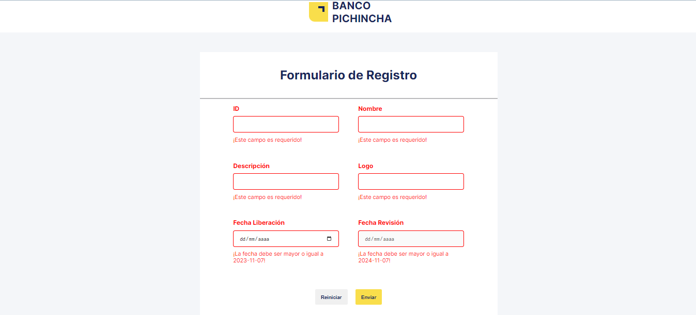

## Getting Started

First, install the dependencies by running:

```bash
npm i
```

After installing the dependencies run the development server by using:

```bash
npm run dev
```

Open [http://localhost:3000](http://localhost:3000) with your browser to see the result.

The will be shown the products list page. Where you will see a table.


In this page you also will have and add product button, a contextual menu by product, a search bar, a pagination, and a records limitators


This is how create form will look:


This is how will look the forms constraints:



The produt ID will have an special validation through databases, and every input has custom constraints:


If there is something that doesn't exits in your search you will notice it:

